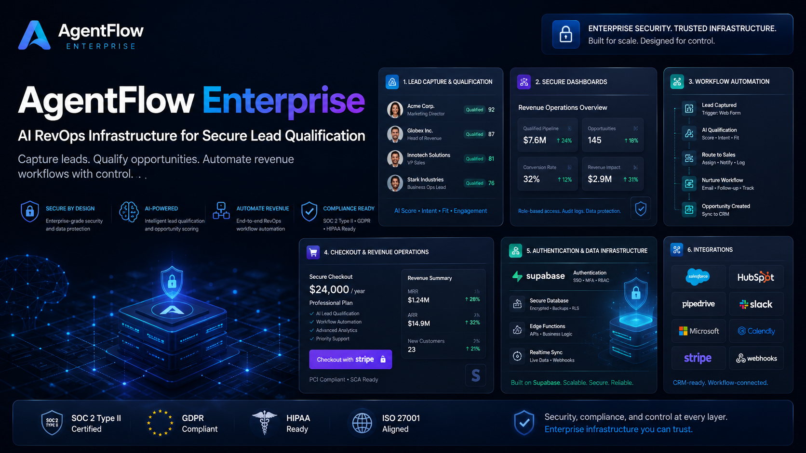

# AgentFlow Enterprise

AI RevOps SaaS foundation for lead qualification, secure workflow automation, and buyer-ready technical due diligence.

AgentFlow Enterprise helps agencies, SaaS founders, and RevOps teams move from disconnected lead forms and manual qualification to a structured workflow: lead intake, AI-assisted scoring, operator review, billing readiness, and CRM/integration handoff.

This repository is a public product showcase only. It does not contain private source code, API routes, database schema, checkout internals, webhook handlers, secrets, or sensitive implementation details.

## Live Evaluation Links

| Resource | Link |
| --- | --- |
| Website | [agentflow-enterprise.com](https://agentflow-enterprise.com) |
| Demo | [agentflow-enterprise.com/demo](https://agentflow-enterprise.com/demo) |
| For Agencies | [agentflow-enterprise.com/for-agencies](https://agentflow-enterprise.com/for-agencies) |
| For Developers | [agentflow-enterprise.com/for-developers](https://agentflow-enterprise.com/for-developers) |
| Technical Due Diligence | [agentflow-enterprise.com/technical-due-diligence](https://agentflow-enterprise.com/technical-due-diligence) |
| Acquisition | [agentflow-enterprise.com/acquisition](https://agentflow-enterprise.com/acquisition) |

## What AgentFlow Solves

Revenue teams and service providers often lose momentum between the first lead signal and the next qualified action. AgentFlow Enterprise is positioned to reduce that gap.

It addresses:

- Slow lead follow-up
- Manual qualification work
- Disconnected forms and intake flows
- Limited visibility between lead capture and revenue operations
- Agencies needing a deployable AI RevOps foundation for client work
- Buyers needing a clear, safe way to evaluate product readiness before private review

## Workflow Overview

Lead Intake -> AI Qualification -> Operator Review -> Billing Readiness -> CRM / Workflow Handoff

This sequence is the product-level operating model. The public repository describes the model without exposing private system internals.

## Who It Is For

| Audience | Why It Matters |
| --- | --- |
| Agencies | A foundation for packaging AI RevOps workflows for client delivery. |
| SaaS Founders | A production-conscious base for turning lead qualification into a SaaS motion. |
| RevOps Consultants | A way to structure qualification, review, and follow-up workflows. |
| Senior Developers | A buyer-safe dossier for understanding product scope before private diligence. |
| Technical Acquirers | A clear starting point for evaluating codebase value, readiness, and remaining validation work. |

## Current Product Truth

AgentFlow Enterprise should be understood as a production-conscious SaaS foundation, not a revenue-validated operating company.

Current public position:

- Production-conscious codebase foundation
- Working public demo flow
- Buyer-readiness documentation
- AI-assisted qualification direction
- Protected dashboard operations at a high level
- Supabase authentication/storage foundation
- Stripe/PayPal checkout readiness
- OpenAI-powered qualification flow
- Vercel deployment posture
- Webhook safety principles
- SEO acquisition pages for agencies, developers, and potential acquirers

Important limits:

- Pre-revenue and not yet customer validated
- No claim of paying customers
- No claim of enterprise adoption
- No SOC 2 or ISO certification claim
- No formal penetration testing claim
- Live provider verification is still required before commercial claims

## Public Documentation Map

- [Product Overview](PRODUCT_OVERVIEW.md)
- [Features](FEATURES.md)
- [FAQ](FAQ.md)
- [Technical Due Diligence](TECHNICAL_DUE_DILIGENCE.md)
- [Security Posture](SECURITY_POSTURE.md)
- [Buyer Information](BUYER_INFORMATION.md)
- [Roadmap](ROADMAP.md)
- [Contact](CONTACT.md)
- [Docs index](docs/overview.md)

## What This Repository Includes

- Buyer-facing product narrative
- Enterprise FAQ
- High-level technical due diligence guidance
- Security posture overview
- Buyer and acquisition evaluation path
- Honest roadmap and verification boundaries
- Asset guidance for public-safe visuals
- GitHub issue template for serious buyer inquiries

## What This Repository Intentionally Excludes

- Private source code
- Backend logic
- API route names or internals
- Database schema
- Checkout internals
- Webhook handler code
- Secrets, credentials, or deployment configuration
- Supabase private project details
- Operational runbooks
- Security control internals

## Evaluation Guidance

Use this public repository for first-pass review. Serious licensing, agency deployment, technical review, or acquisition conversations should move into a controlled private diligence process with appropriate confidentiality terms.

